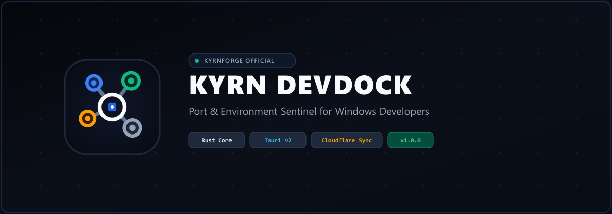
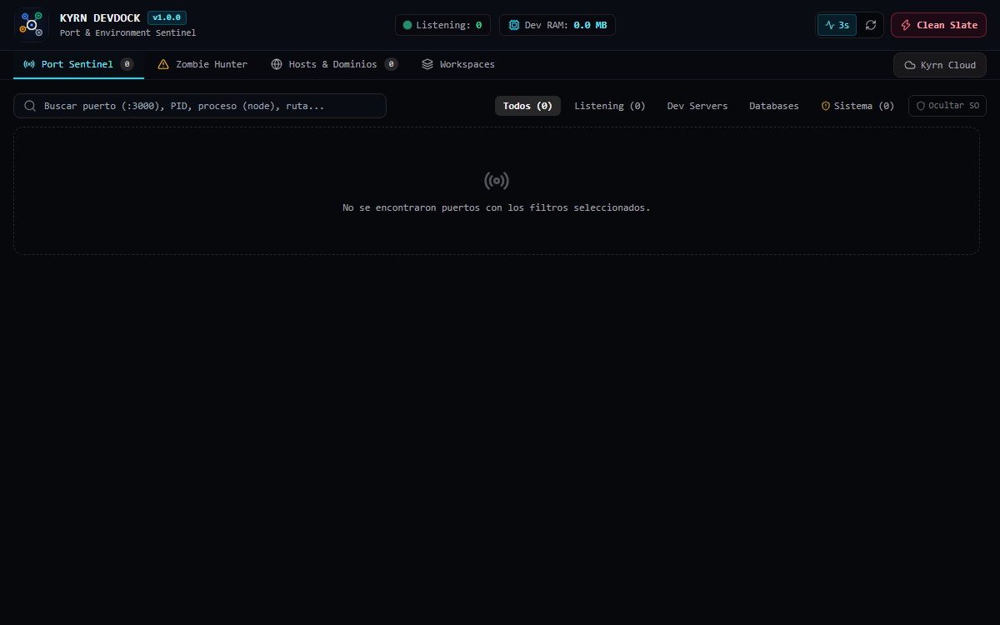
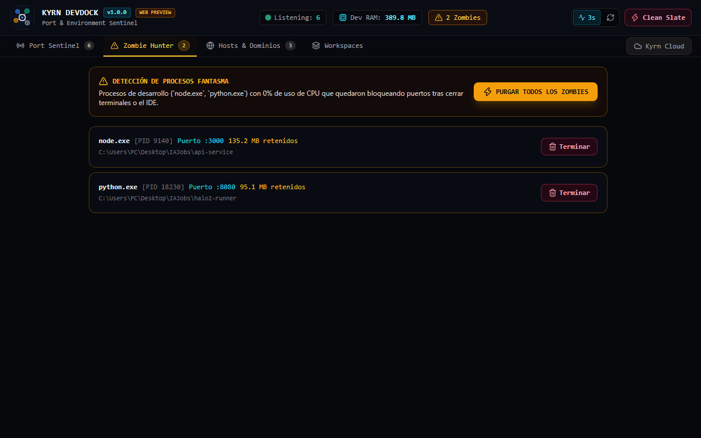
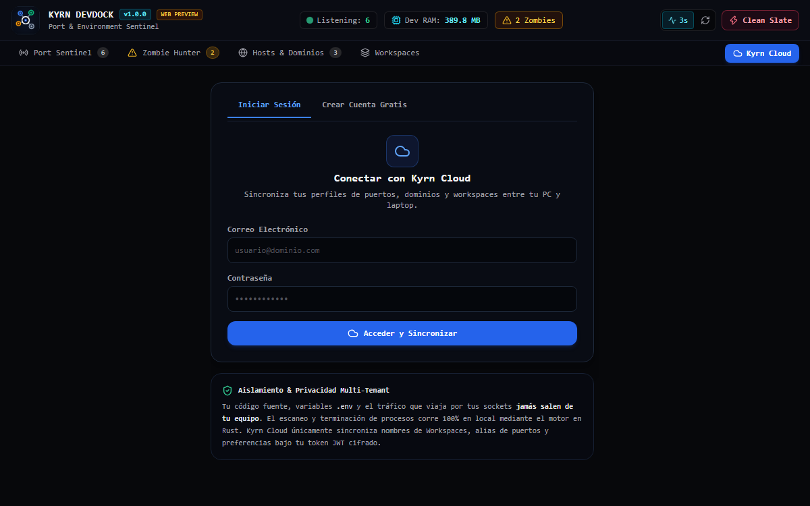
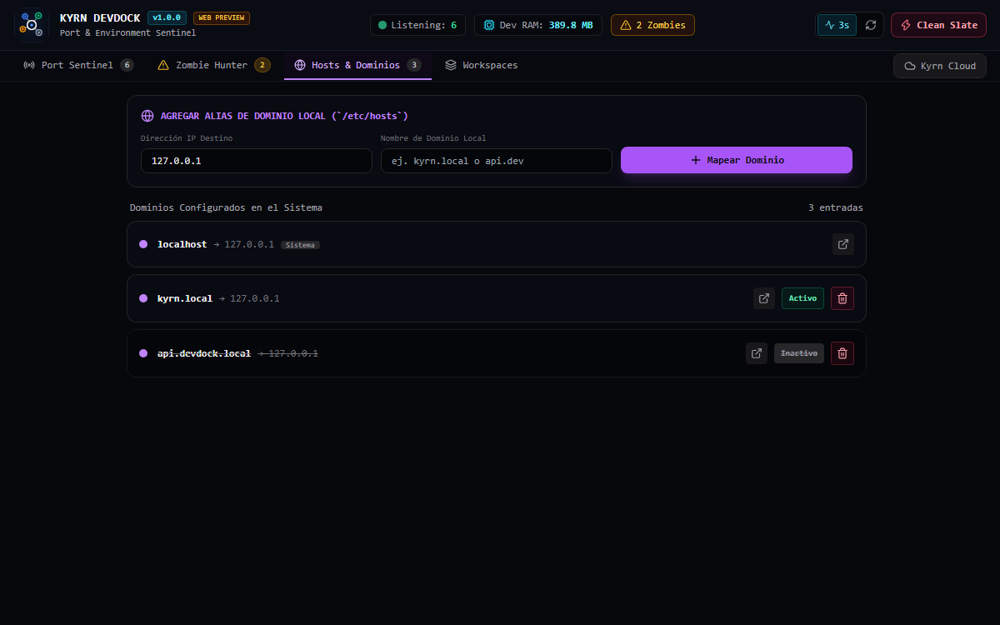

<div align="center">



# Kyrn DevDock · Port & Environment Sentinel

**El centinela definitivo de puertos, microservicios y procesos locales para desarrolladores en Windows.**  
Construido con un motor nativo en **Rust**, interfaz en **Tauri v2** y sincronización serverless en el Edge de **Cloudflare**.

[](./release)
[](./release)
[](https://www.rust-lang.org)
[](https://kyrnforge.dev)
[](./LICENSE.md)

[📥 Descargar Instalador Oficial (v1.0.0)](#-descargas-oficiales) • [🚀 Características](#-características-principales) • [📸 Capturas de Pantalla](#-capturas-de-pantalla) • [🔒 Privacidad y Licencia](#-privacidad-y-licencia) • [🌐 Ficha para KyrnForge.dev](#-ficha-oficial-para-publicar-en-kyrnforge-dev)

</div>

---

## 📌 ¿Qué es Kyrn DevDock?

Cuando trabajas con múltiples stacks simultáneos (**Vite, Next.js, FastAPI, Node, Docker, PostgreSQL, Go**), es común toparse con el molesto error:
> `Error: listen EADDRINUSE: address already in use :::3000`

Tener que abrir el Administrador de Tareas, ejecutar `netstat -ano | findstr :3000` y luego `taskkill /PID ... /F` interrumpe tu flujo de trabajo. 

**Kyrn DevDock** resuelve esto de forma instantánea y elegante:
- Inspecciona las tablas de sockets a nivel de kernel mediante **Rust** en submilisegundos.
- Identifica el **PID**, nombre del proceso, ruta ejecutable exacta, carpeta de trabajo (`cwd`), consumo de **RAM** y uso de **CPU**.
- Clasifica automáticamente procesos de desarrollo, servidores de bases de datos y procesos críticos del sistema operativo.
- Te permite **liberar puertos con un solo clic de forma 100% segura**.

---

## 📸 Capturas de Pantalla

### 1. Panel Centinela de Puertos en Tiempo Real
Monitoreo activo de puertos, consumo de recursos por proceso, filtrado instantáneo y advertencias para procesos del sistema.
<div align="center">
  
</div>

<br />

### 2. Cazador de Procesos Fantasma (Zombie Hunter)
Detecta instancias de `node.exe` o `python.exe` olvidadas que quedaron consumiendo RAM y reteniendo puertos tras cerrar el editor o la terminal.
<div align="center">
  
</div>

<br />

### 3. Sincronización Multi-Inquilino · Kyrn Cloud
Sincroniza tus perfiles de puertos y dominios virtuales entre tu PC de escritorio y tu laptop con aislamiento criptográfico total.
<div align="center">
  
</div>

<br />

### 4. Administrador de Hosts y Dominios Virtuales
Gestiona alias amigables tipo `.local` directamente mapeados a tus puertos locales para evitar recordar direcciones IP complejas.
<div align="center">
  
</div>

---

## ⚡ Características Principales

| Característica | Descripción |
| :--- | :--- |
| **🦀 Motor Nativo en Rust** | Cero sobrecarga de Node.js o Electron en el backend. Las lecturas de red tardan menos de 1 milisegundo. |
| **🛡️ Escudo de Seguridad OS** | Provee alertas y protecciones visuales para evitar matar por error servicios vitales como `svchost.exe`, `System` o procesos raíz (PID $\le$ 4). |
| **🧟 Zombie Hunter & Clean Slate** | Encuentra procesos huérfanos con 0% de CPU reteniendo sockets y los purga en masa con un solo clic. |
| **🌐 Dominios Virtuales** | Asigna dominios limpios como `app.devdock.local` o `api.devdock.local` a tus servidores en desarrollo. |
| **☁️ Kyrn Cloud (Multi-Tenant)** | Respaldos serverless en el Edge de Cloudflare (`kyrnforge.dev`). Autenticación JWT cifrada con sal individual por usuario. |
| **🎨 Interfaz Dark Titanium** | Estética mate moderna diseñada para programadores con cero colores chillones ni distractores visuales. |
| **📦 Instalador Certificado** | Instalador profesional NSIS con soporte de instalación por usuario o máquina completa y manifiesto seguro `asInvoker`. |

---

## 📥 Descargas Oficiales

Los ejecutables listos para su uso se encuentran empaquetados en la carpeta [`release/`](./release):

| Archivo | Formato | Tamaño | Descripción |
| :--- | :--- | :--- | :--- |
| [**`Kyrn-DevDock-Setup-1.0.0.exe`**](./release/Kyrn-DevDock-Setup-1.0.0.exe) | **Instalador NSIS** | **1.76 MB** | Instalador completo con accesos directos, desinstalador y configuración en Windows. *(Recomendado)* |
| [**`Kyrn-DevDock-Portable-1.0.0.exe`**](./release/Kyrn-DevDock-Portable-1.0.0.exe) | **Portable Standalone** | **4.95 MB** | Ejecutable directo sin instalación. Listo para memorias USB o entornos portátiles. |

### 🔐 Verificación de Integridad (SHA-256)
Para asegurar que tu descarga no ha sido adulterada, verifica los hashes disponibles en [`release/SHA256SUMS.txt`](./release/SHA256SUMS.txt):

```text
8F079649D50813F5BB34BA02FC835E751DA71DFB72F2DBA8C23F23139BAA610B *Kyrn-DevDock-Setup-1.0.0.exe
5ADBBA23C0877ECC75A088285EB8DADAFAE9E713918E362B14907E09D7F4A467 *Kyrn-DevDock-Portable-1.0.0.exe
```

---

## 🔒 Privacidad y Licencia

Kyrn DevDock se distribuye bajo la **Licencia Comunitaria Oficial de KyrnForge** ([ver documento completo LICENSE.md](./LICENSE.md)):

1. **100% de Privacidad Local Garantizada:** El análisis de sockets y procesos se ejecuta exclusivamente en tu memoria local. **Ningún archivo de tu código, variable de entorno `.env` o paquete de red sale de tu computadora**.
2. **Distribución de Binarios Sin Código Fuente:** Este repositorio alberga los binarios ejecutables, assets y documentación. El código fuente original se mantiene cerrado bajo propiedad intelectual de **KyrnForge**.
3. **Uso Libre y Gratuito:** Puedes utilizar libremente los binarios oficiales para tus proyectos personales, comerciales o corporativos.
4. **Restricción de Ingeniería Inversa:** Queda prohibida la descompilación, alteración de cabeceras o redistribución bajo otra marca sin consentimiento expreso.

---

## 🌐 Ficha Oficial para Publicar en KyrnForge.dev

A continuación tienes los datos exactos con el formato requerido para dar de alta el proyecto en el panel administrativo de [**kyrnforge.dev**](https://kyrnforge.dev):

```yaml
# =============================================================================
# FICHA DE PUBLICACIÓN EN KYRNFORGE.DEV
# =============================================================================

ID Único (slug):
kyrn-devdock

Categoría Filtro:
Herramientas & Web / Plataforma (tools)

Nombre del Proyecto:
Kyrn DevDock

Etiqueta de Categoría:
Herramientas Dev & Red Local

Estado / Etiqueta del Badge:
v1.0.0 Oficial

Color del Badge:
Verde (Producción)  [border-emerald-500/40 text-emerald-400 bg-emerald-950/30]

Icono de Proyecto:
/projects/kyrn-devdock.png

Descripción del Proyecto:
Centinela de puertos y entornos de desarrollo locales creado en Rust y Tauri v2. Diagnóstico en tiempo real de sockets TCP/UDP, detección de procesos huérfanos (Zombie Hunter) con terminación segura, gestión de dominios virtuales .local y sincronización multi-tenant cifrada con Kyrn Cloud (kyrnforge.dev).

Etiquetas / Tags:
Port Sentinel, Network Diagnostics, Tauri v2, Rust Core, Process Killer, Multi-Tenant Cloud, Windows 11, DevTools

Enlace Repositorio GitHub:
https://github.com/devlwte/kyrn-devdock

Enlace Descarga:
https://github.com/devlwte/kyrn-devdock/releases

Marcar como Proyecto Insignia (Flagship):
Activado (Checked)
```

---

<div align="center">
  <sub>Desarrollado con precisión por <strong><a href="https://kyrnforge.dev">KyrnForge</a></strong> · 2026</sub>
</div>
